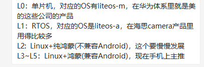

# 新项目需求拆解

## 一、RM.001 L1 LiteOS-A内核移植自研binder驱动

### 1.1 需求描述

基于linux自研binder驱动（代码量4K），移植到LiteOS-A内核，主要涉及process、mmap等内核api的切换和调试，需要到达如下目标：
完整支持binder协议，对用户态来说，本驱动行为与linux binder驱动完全一致；用户态IPC只需要一套代码就可以对接L1 Linux和LiteOS-A内核；

### 1.2 需求拆解和要求

1.2.1 当前华为方在Linux上已经开发一套自研的binder驱动，需要移植到lite_os上

1.2.2 移植到Lite_os上后保证用户使用的时候无感知，即在切换内核系统的时候，用户态的代码无修改能够正常使用，因此驱动的功能以及驱动名均应该保持一致

1.2.3 binder移植后对接的是欧拉系统，不需要要考虑Android系统，主要使用在L0~L2级别上用，交付在L1平台

### 1.3 涉及到的问题处理

1.3.1 L0~L5分别代表的是什么

1.3.2 Harmony不同级别的代码如何划分的，即每个级别的代码如何独立拉出来

​	朱有鹏老师视频：http://t.elecfans.com/19489.html

​	HarmonyL2官网源码获取，参考链接https://bbs.elecfans.com/jishu_2142192_1_1.html：

1. repo init -u https://gitee.com/openharmony/manifest.git -b master --no-repo-verify
2. repo sync -c
3. repo forall -c 'git lfs pull'

1.3.3 编译工具gn的学习

​	参考目录gn编译工具下的资料

​	https://bbs.elecfans.com/jishu_2033906_1_1.html

1.3.4 binder驱动学习了解

​	韦东山视频：https://www.100ask.net/detail/p_5e8fcf9c96b31_mYHm2N7M/6

​	书籍资料：《深入理解Android内核设计思想》

1.3.4 binder在linux下的代码

​	源代码路径：linux-5.10.18/drivers/android

​	测试代码路径：linux-5.10.18/tools/testing/selftests/filesystems/binderfs/binderfs_test.c和linux-5.10.18/samples/binderfs/binderfs_example.c

​	文档路径：linux-5.10.18/Documentation/admin-guide/binderfs.rst

## 二、L2用户态IPC（C++实现，不包括RPC部分）移植调试到L1 Linux

### 2.1 需求描述

移植L2用户态IPC（C++实现，不包括RPC部分）到L1 Linux，接口及接口行为与L2保持一致（RPC部分除外）

### 2.2 需求拆解和要求

2.2.1 当前L1下的ipc用户态代码是使用C语言实现的，缺点比较多，L2下的ipc是C++实现的，现在要求将L2下的ipc移植到L1的Linux下，移植完成后要求接口及接口行为与L2保持一致

## 三、L2用户态IPC（C++实现，不包括RPC部分）移植调试到L1 LiteOS-A下

### 3.1 需求描述

移植L2用户态IPC（C++实现，不包括RPC部分）到L1 LiteOS-A，接口及接口行为与L2保持一致（RPC部分除外）

### 3.2 需求拆解和要求

3.2.1 当前L1下的ipc用户态代码是使用C语言实现的，缺点比较多，L2下的ipc是C++实现的，现在要求将L2下的ipc移植到L1的LiteOS-A下，移植完成后要求接口及接口行为与L2保持一致

### 3.3 涉及到的问题处理

3.3.1 ipc代码当前可参考linux原生代码：linux-5.10.18/ipc

## 四、L1之前C接口IPC各个子系统统一切到C++版本IPC

### 4.1 需求描述

将L1（LiteOS-A+Linux）上之前使用C接口IPC的各子系统统一切换到C++版本IPC

### 4.2 需求拆解和要求

4.2.1 L1上将各个子系统使用C接口的IPC统一切换到C++接口

4.2.2 目前需求涉及到samgr_lite multimedia graphic appexecfwk_lite dsoftbus aafwk_lite ai appspawn_lite sensor_lite permission_lite deviceauth powermgr_lite 模块

4.2.3 切换后子系统业务正常运行，性能无劣化

### 4.3 涉及到的问题处理

4.3.1 关于移植后的ipc的性能测试的实现

### 4.4 人力安排

​	需求二和需求三所涉及的类似，只不过kernel底层不同，在实现上需求一和需求二可以并行处理，等需求一完成后，可以需求一和需求三联调适配

​	前面三个需求投入2个人力，周期预计1.5个月内完成，一个人负责需求一、一个人负责需求二，然后完成后合力完成需求三。时间上安排主要在于前期基础学习时间相对会比较多。

​	需求四需要等前面三个需求完成后才能启动

​	整个前面四个需求投入4个人力

五、人员到岗计划

目前项目预计投入总人力36人，包括项目经理1人，QA2人，项目开发骨干人员20人、自动化脚本开发人员2人、实际开发人员12人

具体到岗安排：9月份入项人员30%左右，合计12人，后续人员在逐步招聘和内部协调

六、客户需要提供的资料

1、需求RM001-RM004中需要提供自研binder的源代码和相关的介绍文档；L2实现的C++接口

